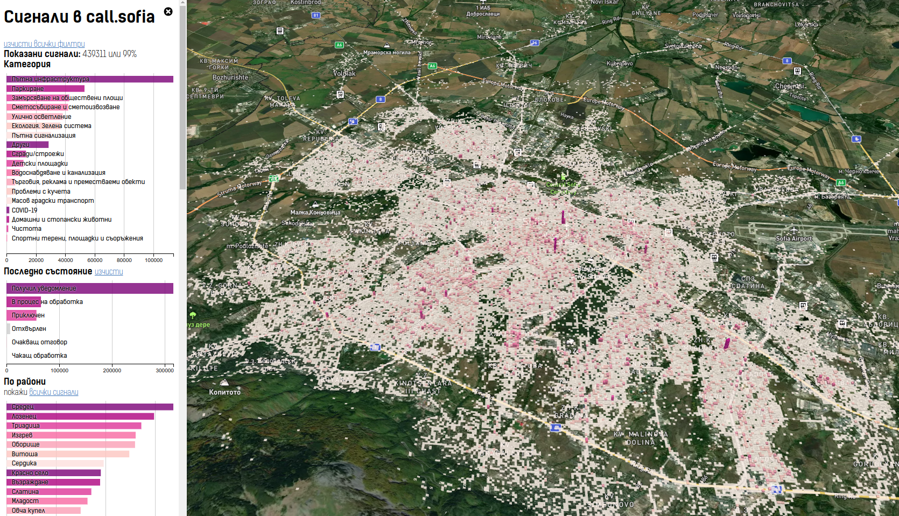

# Call.Sofia 3D Map

3D визуализация на исторически данни на сигнали в портала на Столична община за София.

Оригинална страница: https://opendata.yurukov.net/callsofia/explore/

Блог статия по темата: https://yurukov.net/blog/2022/call-sofia-opendata/

Вижте [site/data/README.md](site/data/README.md) за модела на данните и кодирането им

В момента картата зависи от два ресурса изискващи ключ към Mapbox: 
 - mapbox://yurukov.call-sofia-tileset - векторен tileset с квартатите за визуализацията
 - mapbox://styles/mapbox/satellite-streets-v12 - сателитни снимки + терен
И двете може да се използват с който и да е ключ на Mapbox, защото са публични. 
